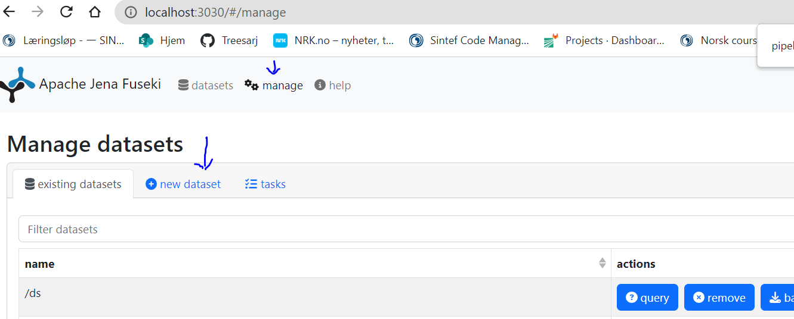
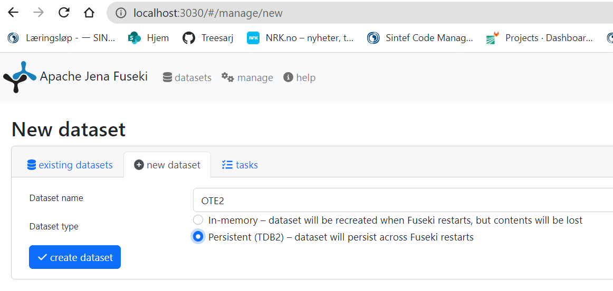

# Proof of Concept Demonstrator for Partial pipelines 

A demonstrator for showing data interoperability between data from a provider and data required by a data consumer (who might require it in another form), by making use of OTEAPI (OntoTrans) and  DLite.

## User Stories

User stories are explained in DEMO.ipynb

### How to execute?

docker-compose up --build -d

Go to http://localhost:3030/#/manage
login: 
user:admin
pwd:secret

create OTE2 database in fuseki:

and run Juputer lab and use DEMO.ipynb

### some packages to be installed :
Go to oteutils folder:

- pip install -r requirements.txt

we also need a new version of otelib(small bug fix but not yet released)

- pip install otelib-0.3.0-py3-none-any.whl

